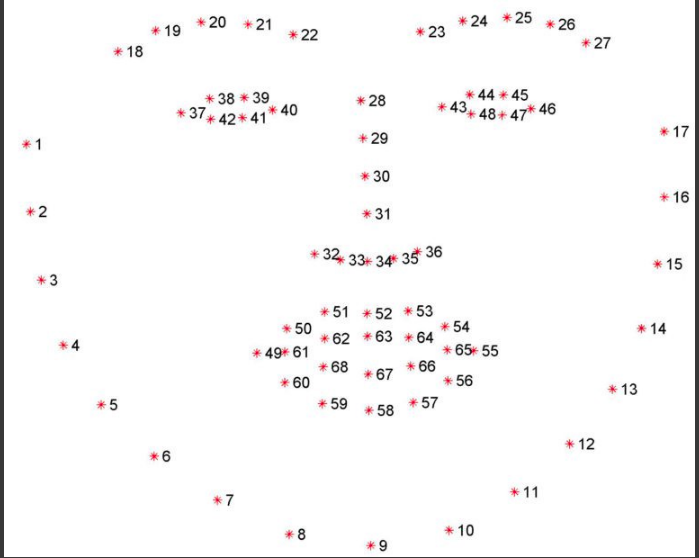
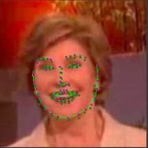
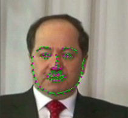
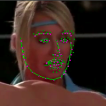
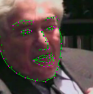

# Facial -KeyPoints Detection Using CNN
Here we're defining and training a convolutional neural network to perform facial keypoint detection, and using computer vision techniques to transform images of faces. The first step in any challenge like this will be to load and visualize the data you'll be working with.

Let's take a look at some examples of images and corresponding facial keypoints.


Facial keypoints (also called facial landmarks) are the small magenta dots shown on each of the faces in the image above. In each training and test image, there is a single face and 68 keypoints, with coordinates (x, y), for that face. These keypoints mark important areas of the face: the eyes, corners of the mouth, the nose, etc. These keypoints are relevant for a variety of tasks, such as face filters, emotion recognition, pose recognition, and so on. Here they are, numbered, and you can see that specific ranges of points match different portions of the face .




## Installation

Use the package manager [pip](https://pip.pypa.io/en/stable/) to install foobar.

```bash
pip install opencv
pip install torch
```

## Usage

```python
1. facial_keypoints.ipynb
```
go through above notebook to understand how we use CNNs to capture facial keypoints from images . 

## Results
some images contains model results of facial keypoint extraction .







## Contributing
Pull requests are welcome. For major changes, please open an issue first to discuss what you would like to change.

Please make sure to update tests as appropriate.

## License
Apache License 2.0